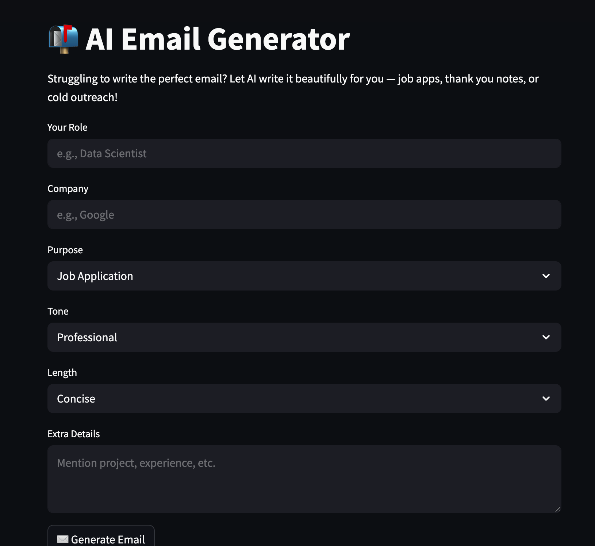
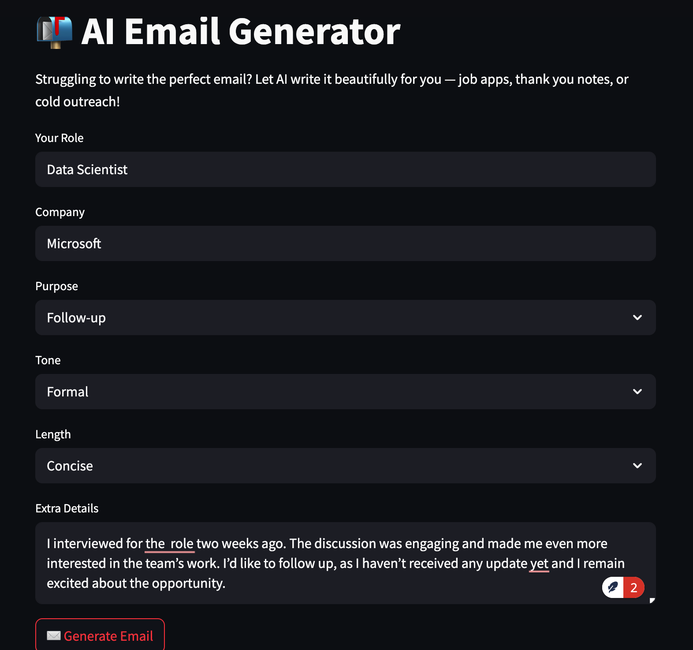
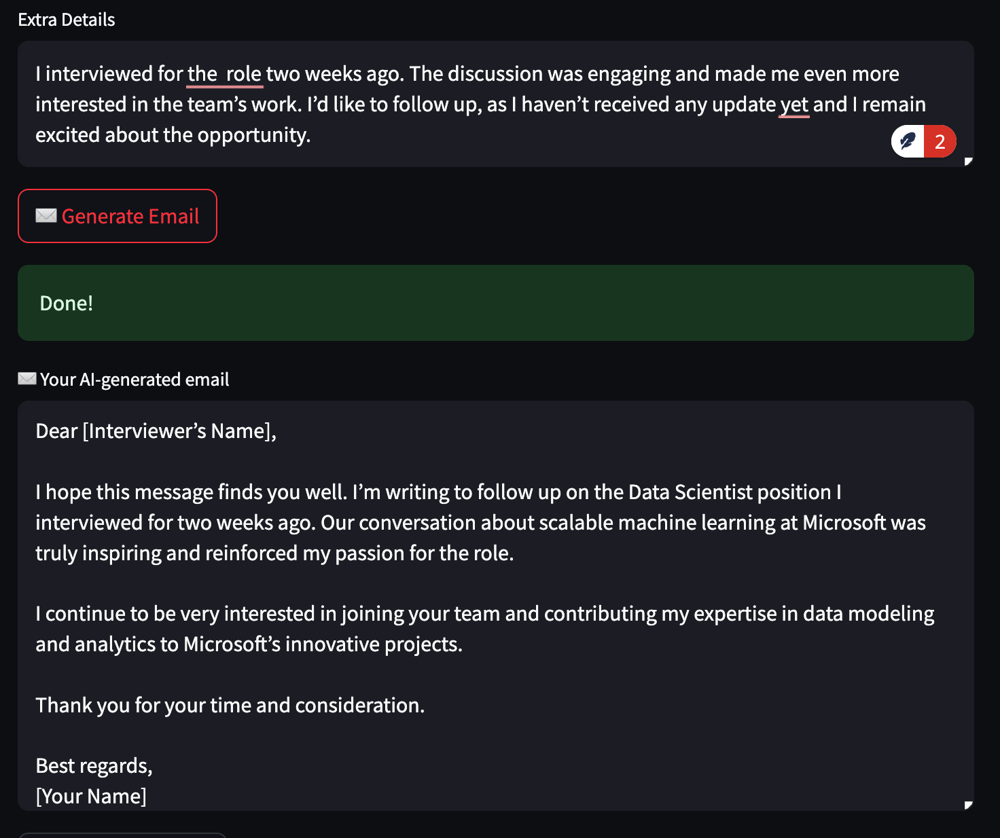

# ✉️ AI Email Generator

Generate smart, personalized emails instantly using GPT — from job applications to thank-you notes, interview follow-ups, and more.

Built with ❤️ using [Streamlit](https://streamlit.io/) and [OpenAI's GPT](https://platform.openai.com/).

---

## 🚀 Features

- 🧠 AI-generated emails for:
  - Job Applications
  - Interview Follow-ups
  - Cold Outreach
  - Freelance Proposals
  - Thank You Notes
- 🎯 Customize your:
  - Role
  - Target Company
  - Purpose
  - Tone (Professional, Friendly, etc.)
  - Extra Context
- 📋 Copy to Clipboard
- 📩 Download as `.txt`
- 🖋️ Regenerate with different tone or length
- 💬 User feedback option

---

## 🌐 Live Demo

Try it now → [https://emailgen-llm.streamlit.app/](https://emailgen-llm.streamlit.app/)

---

## 🧠 How It Works
The app sends structured prompts to OpenAI’s GPT model to generate an email based on your inputs like role, company, purpose, and tone. It then displays the email and offers options to copy, download, regenerate, or submit feedback.

## 📸 Screenshots

Here’s what the app looks like:

  
  

An example:

  
  

